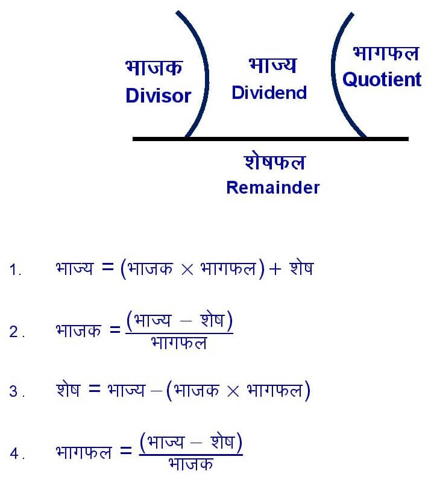

# **What is a Number System?**

A **number system** is a way of **representing numbers** using a set of symbols and rules. It defines how numbers are written, read, and processed mathematically.

## **Types of Number Systems**

There are several number systems used in mathematics and computing:

| Number System             | Base | Digits Used                  | Example |
| ------------------------- | ---- | ---------------------------- | ------- |
| **Binary** (Base-2)       | 2    | 0, 1                         | (1011)₂ |
| **Octal** (Base-8)        | 8    | 0, 1, 2, 3, 4, 5, 6, 7       | (57)₈   |
| **Decimal** (Base-10)     | 10   | 0, 1, 2, 3, 4, 5, 6, 7, 8, 9 | (245)₁₀ |
| **Hexadecimal** (Base-16) | 16   | 0-9, A, B, C, D, E, F        | (3F)₁₆  |

## Types of Conversion --
> **(A)** Decimal to Other base system 
   1. Decimal into Binary Conversion { ( )₁₀ --> ( )₂ }
   2. Decimal into Octal Conversion { ( )₁₀ --> ( )₈ }
   3. Decimal into Hexadecimal Conversion { ( )₁₀ --> ( )₁₆ }
   
> **(A)** Other base system to Decimal
   1. Binary into Decimal Conversion { ( )₂ --> ( )₁₀ }
   2. Octal into Decimal Conversion { ( )₈ -->  ( )₁₀ }
   3. Hexadecimal into Decimal Conversion { ( )₁₆ --> ( )₁₀}

> **(B)** Non-Decimal to Other base system
   1. Binary into Octal Conversion { ( )₂ --> ( )₈ }
   2. Binary into Hexadecimal Conversion { ( )₂ --> ( )₁₆ }
   3. Octal into Binary Conversion { ( )₈ -->  ( )₂ }
   4. Hexadecimal into Binary Conversion { ( )₁₆ --> ( )₂ }
   5. Octal into Hexadecimal Conversion { ( )₈ -->  ( )₁₆ }
   6. Hexadecimal into Octal Conversion { ( )₁₆ --> ( )₈ }

 

**(A) Decimal to Other base system:**

It is the process of converting a number from the decimal system (base 10) to another number system such as binary (base 2), octal (base 8), or hexadecimal (base 16) by repeatetly dividing the number by the target base and recording the remainders.

Common Steps for Decimal to Other Base Conversion - 
> **Step 1:** *Determine the base of the new number system:*   
> For example,       
>   - If you want to convert Decimal into Binary, the base is 2. 
>   - If you want to convert Decimal into Octal, the base is 8. 
>   - If you want to convert Decimal into Hexadecimal, the base is 16.    
> 
> **Step 1:** *Divide the decimal number to be converted by the base of the new number system:*     
> **Step 2:** *Note the remainder (शेषफल) of the division:*  
> **Step 3:** *Divide the quotient (भागफल) from the previous division by the new base:*     
> **Step 4:** *Repeat steps 3 and 4 until the quotient is less than the base:*  
> **Step 5:** *Write the remainders in reverse order to get the new number:*

**1. Decimal into Binary Conversion { ( )₁₀ --> ( )₂ }**
> ***Example 1: Convert (198)₁₀ into (?)₂*    
> Solution:**   
> The binary system uses only 0 and 1. So, base is 2.
> 
> 
>  

   

**2. Decimal into Octal Conversion { ( )₁₀ --> ( )₈ }**
> ***Example 1: Convert (798)₁₀ into (?)₈*    
> Solution:**   
> The base of Octal is 8.
> 
> 
>

   

**3. Decimal into Hexadecimal Conversion { ( )₁₀ --> ( )₁₆ }**
> ***Example 1: Convert (798)₁₀ into (?)₁₆*    
> Solution:**   
> The base of Hexadecimal is 16.
> 
> 
>
