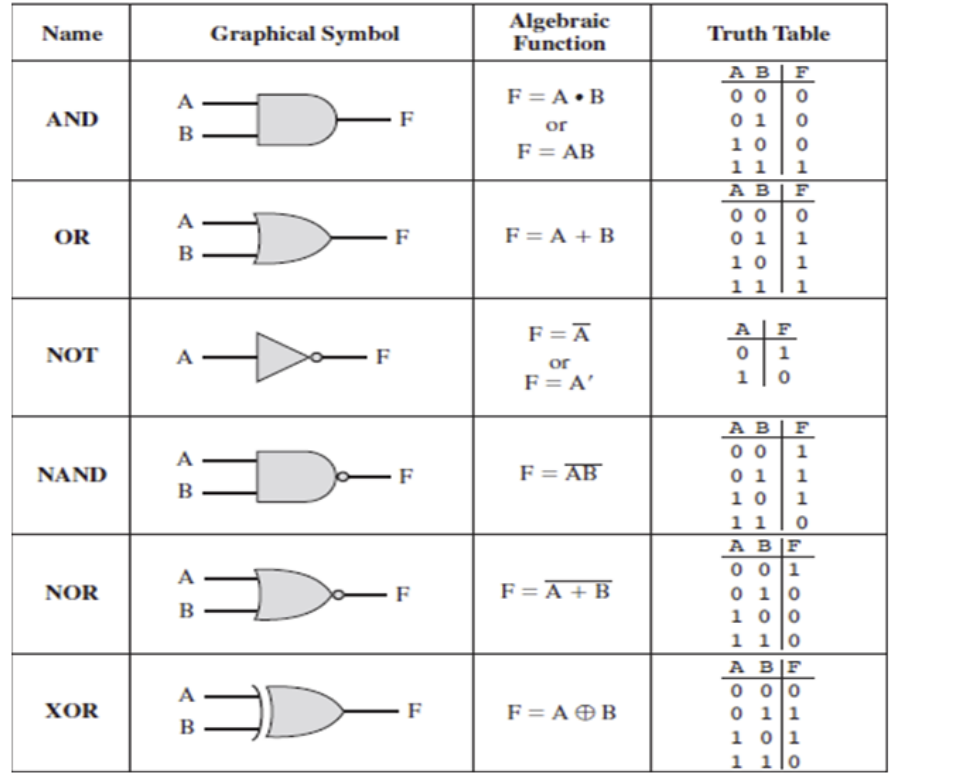
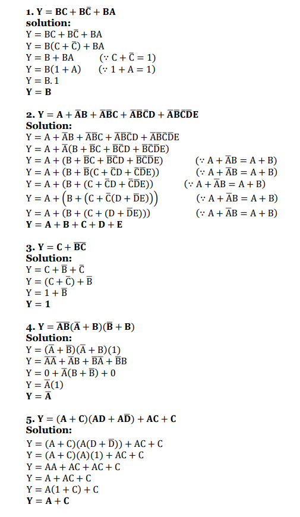
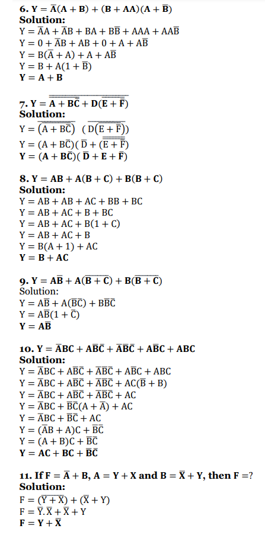
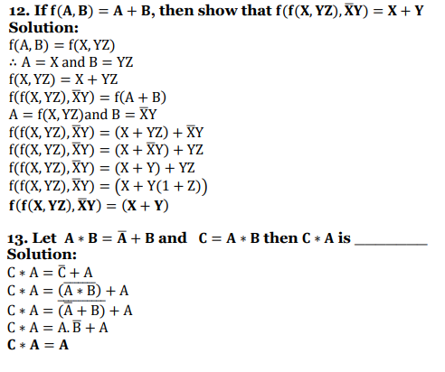

### What is Boolean Algebra?

Boolean algebra is also known as binary algebra or logical algebra. Venn diagrams can be used
to get a visual representation of any Boolean algebra operation. The variables used in Boolean
Algebra only have one of two possible values, a logic “0” and a logic “1” but an expression can
have an infinite number of variables.

- `0` represents `false`, (or `off` is represented by `0`)
- `1` represents `true`, (or `on` is represented by `1`)

### Boolean Function?
A function that contains **boolean variables** (𝐴, 𝐵, 𝐶, etc.) and their **compliments** (𝐴', 𝐵', 𝐶', etc.) with **boolean operations** (`+`, `.`) is called boolean function.
e.g.,   f(A,B,C) = AB' + B'C + CA  
**!Important Note:** Number of maximum boolean functions can be formed using `n` boolean variables = **22n**

**Ques. How many boolean functions can be formed using one boolean variable?**  
Number of boolean function can be formed using n boolean variable is = 22n  
then, 
number of boolean function can be formed using 1 boolean variable = 221 = 22 = 4.  
for example: let suppose `X` is boolean variable then possible boolean functions is  
- X
- X'
- X + X'
- X . X'

**Ques. How many maximum boolean functions can be formed using 3 boolean variables X, Y, Z ?**  
**Ans.** 223 = 28 = 256.

**Ques. There are maximum 2048 boolean functions, How many different variables are used ?**  
&emsp; a) 12  
&emsp; b) 6   
&emsp; c) 11  
&emsp; d) None   
**Ans.** 22n = 2048      
22n = 211  
2n = 11  (n ∈ N)  
_correct option (d) none_

### Representation of Boolean Functions? 
There are two standard ways to represent boolean functions --   
1. **Sum of Products (SOP):** 
   - It is also called **Disjunctive Normal Form (DNF)**.
   - Each term in SOP is called a **minterm**.
   - **e.g.,** F = (A ⋅ B) + (B ⋅ C) + (A ⋅ C)   𝐹 = 𝐴𝐵'𝐶 + 𝐴𝐵𝐶' + 𝐴𝐵𝐶
   - The **Σ (Sigma)** symbol is used to denote the sum of minterms.   **Representation** F(A, B, C) = Σm(0, 1, 3, 7)
3. **Product of Sums (POS):**
   - It is also called **Conjunctive Normal Form (CNF)**.
   - Each term in POS is called a **maxterm**.
   - **e.g.,** F = (A + B) . (B + C) . (A + C)   F = (A' + B + C) . (A + B' + C').
   - The **&pi; (Pi) symbol** is used to denote the product of maxterms.   **Representation** F(A, B, C) = &pi;M(2, 4, 5, 6)

### Minimization of Boolean Functions?   
Minimization is the process of reducing a Boolean function to its simplest (smallest) form, which helps in designing optimized logic circuits. The main methods used for Boolean function minimization are:
1. **Using Boolean Algebra:** This method uses Boolean laws and theorems to simplify expressions manually.
2. **Using Karnaugh Map (K-map) Method:** A K-map is a graphical way to minimize Boolean expressions for up to 4 or 5 variables.

**Important Results:**
- Complete SOP boolean function Always gives result `1`.   
  e.g., For two variables complete SOP: &nbsp;  F(A, B) = AB + A'B + AB' + A'B'  
  **Minimize**   = AB + A'B + AB' + A'B'   = B(A + A') + B'(A + A')   = B.1 + B'.1   = B + B'   = 1
- Complete POS boolean function Always gives result `0`.   
  e.g., For two variables complete POS: &nbsp; F(A, B) = (A + B)(A + B')(A' + B)(A' + B')  

### Boolean Algebra Operators?
Boolean Algebra consists of fundamental operators used in logic circuits, programming, and mathematical expressions.

| **Operator** | **Symbol** | **Procedure Name** | **Name**        | **Truth Table Example**     |
|--------------|-----------|---------------------|-----------------|-----------------------------|
| AND        | `.` (or `∧`) | Intersection or  Multiplication  | Conjunction     |  `A . B = Y`   `0 . 0 = 0`   `0 . 1 = 0`   `1 . 0 = 0`   `1 . 1 = 1` |
| OR         | `+` (or `∨`) | Union or  Addition  | Disjunction        |  `A + B = Y`   `0 + 0 = 0`   `0 + 1 = 1`   `1 + 0 = 1`   `1 + 1 = 1` |
| NOT        | `'` or `¯` (or `¬`) | Complement or   Inversion | Negation           | `A' = Y`   `0' = 1`   `1' = 0` |
| NAND       | ↑            |         | NOT AND            |  `A ↑ B = Y`   `0 ↑ 0 = 1`   `0 ↑ 1 = 1`   `1 ↑ 0 = 1`   `1 ↑ 1 = 0` |
| XOR        | ⊕           |         | Exclusive OR      |  `A ⊕ B = Y`   `0 ⊕ 0 = 0`   `0 ⊕ 1 = 1`   `1 ⊕ 0 = 1`   `1 ⊕ 1 = 0` |
| NOR        | ↓            |         | NOT OR             |  `A ↓ B = Y`   `0 ↓ 0 = 1`   `0 ↓ 1 = 0`   `1 ↓ 0 = 0`   `1 ↓ 1 = 0` |
| XNOR       | ⊙           |         | Exclusive NOR     |  `A ⊙ B = Y`   `0 ⊙ 0 = 1`   `0 ⊙ 1 = 0`   `1 ⊙ 0 = 0`   `1 ⊙ 1 = 1` |

📝 **Important Note:**

- **AND (.)**: True when both inputs are **true**.
- **OR (+)**: True when at least **one** input is **true**.
- **NOT (¯ or ')**: Inverts the input.
- **XOR (⊕)**: True when inputs are **different**.
- **NAND (↑)**: True unless both inputs are **true**.
- **NOR (↓)**: True when both inputs are **false**.
- **XNOR (⊙)**: True when inputs are **the same**.

### Basic logic gates

### Laws of Boolean Algebra

| **Name of Law**  | **AND Form** | **OR Form** | 
|------------------|--------------|-------------|
| Identity law     | 𝐴 . 1 = 𝐴     | 𝐴 + 0 = 𝐴   |
| Null law         | 𝐴 . 0 = 0     | 𝐴 + 1 = 1   |
| Idempotent law   | 𝐴 . 𝐴 = 𝐴     | 𝐴 + 𝐴 = 𝐴  |  
| Inverse law      | 𝐴 . 𝐴' = 0     | 𝐴 + 𝐴'= 1    | 
| Commutative law  | 𝐴 . 𝐵 = 𝐵 . 𝐴   | 𝐴 + 𝐵 = 𝐵 + 𝐴 | 
| Associative law  | 𝐴 . (𝐵 . 𝐶) = (𝐴 . 𝐵) . 𝐶    |    𝐴 + (𝐵 + 𝐶) = (𝐴 + 𝐵) + 𝐶 |  
| Distributive law | 𝐴 . (𝐵 + 𝐶) = 𝐴 . 𝐵 + 𝐴 . 𝐶   | 𝐴 + (𝐵𝐶) = (𝐴 + 𝐵)(𝐴 + 𝐶)    | 
| Absorption law   | 𝐴(𝐴 + 𝐵) = 𝐴    𝐴 . (𝐴' + 𝐵) = 𝐴 . 𝐵   |  𝐴 + 𝐴𝐵 = 𝐴    𝐴 + (𝐴' . 𝐵) = 𝐴 + 𝐵     | 
| Other            | (𝐴')' = 𝐴   .' = + |    +' = `.`     |
| De Morgan's law  | (AB)' = A' + B'   (ABC...)' = A' + B' + C' + ...  |  (A + B)' = A' . B'   (A + B + C + ...)' = A' . B' . C' . ... | 

### Questions and Solutions.

